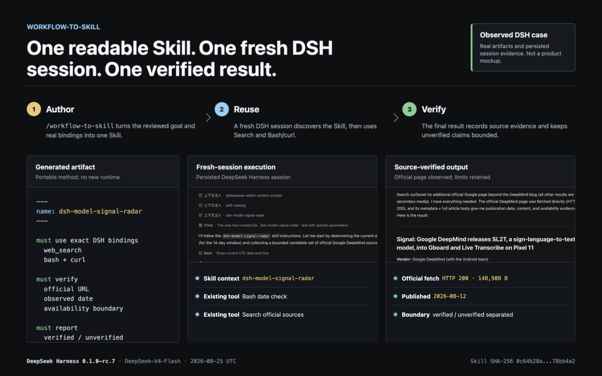

# Workflow-to-Skill

English | [简体中文](README.zh-CN.md)

<p align="center">
  <a href="https://github.com/deepseek-ai/deepseek-harness"></a>
</p>

<p align="center">
  <strong>Turn a goal and existing tools into one reusable Agent Skill.</strong><br>
  No required execution DAG. No new runtime. Your Harness keeps using its existing CLI, MCP, HTTP, and APIs.
</p>

<p align="center">
  <code>goal + existing tools -> SKILL.md -> fresh Harness session -> verified result</code>
</p>



<p align="center"><sub>Evidence map built from a generated Skill and a real persisted DSH session. <a href="reference/evidence/dsh-model-signal-radar/README.md">Inspect the case record.</a></sub></p>

## Install With Your AI Harness

Copy this one message into Codex or another compatible AI Harness:

```text
Install and configure Workflow-to-Skill by following this guide:
https://raw.githubusercontent.com/ailiheizi/workflow-to-skill/refs/heads/main/AI_GUIDE.md
```

The Harness reads the guide, installs the two authoring Skills in its native
Skill location, confirms discovery, and shows how to create the first workflow.
Review any file changes it proposes before accepting them.

## Verified End To End In DSH

This is a real persisted DSH session, not a product mockup. A live Agent first
used `workflow-to-skill` to write `dsh-model-signal-radar`. A fresh session then
discovered and explicitly invoked that Skill, which used DSH's existing
`web_search` and `bash`/`curl` capabilities.

The run fetched an official DeepMind page with HTTP 200, observed its publication
date, returned a source-linked result, and kept device-level availability and
vendor benchmark claims explicitly unverified.

```text
created with workflow-to-skill
-> discovered in a fresh DSH session
-> web_search + bash/curl
-> official URL fetched with HTTP 200
-> verified result returned
```

Evidence: [case record](reference/evidence/dsh-model-signal-radar/README.md),
[generated Skill](reference/evidence/dsh-model-signal-radar/SKILL.md),
[request](reference/evidence/dsh-model-signal-radar/reuse-request.md), and
[result](reference/evidence/dsh-model-signal-radar/success-output.md).

Observed with DSH `0.1.0-rc.7` and `DeepSeek-V4-Flash` on 2026-08-26 in
Asia/Shanghai (`2026-08-25` UTC). DSH is the first verified reference Harness,
not a dependency or an endorsement. The portable asset remains the Skill;
another Harness must provide equivalent discovery and tool bindings.

## What This Repository Is

Workflow-to-Skill turns a goal and existing tool capabilities into a readable,
reviewable, reusable Agent Skill.

The project has only three core artifacts:

- this `README.md`, which defines the authoring standard;
- [`workflow-to-skill`](workflow-to-skill/SKILL.md), which creates a workflow
  Skill;
- [`workflow-to-skill-with-surface`](workflow-to-skill-with-surface/SKILL.md),
  which creates the same kind of Skill plus an optional dedicated Prompt
  Surface.

Everything under `reference/` is a selected reference adapter, example, test,
fixture, legal notice, or evidence file. It is not another product layer.

## The Core Idea

A workflow does not have to be a graph. Here it is an Agent-readable method for
reaching a result:

```text
goal + inputs + real capabilities
-> recommended method and decisions
-> failure and recovery behavior
-> verifiable result
```

The Skill describes how to reach the goal. The Harness loads the Skill, runs
the Agent, and invokes tools. Existing CLI, MCP, HTTP, API, Weft, Dify, n8n,
ComfyUI, or other systems perform the real work.

```text
ordinary user request
-> Harness + Agent + workflow Skill
-> existing capabilities
-> observed result and evidence
```

Workflow-to-Skill owns no executor, tool registry, workflow engine, DAG,
queue, scheduler, state store, compiler, IR, DSL, or Page runtime. If the
target Harness lacks a capability, report that integration gap rather than
inventing one inside the Skill.

This is the distinction:

- **portable**: goal, method, decision boundaries, recovery, and success
  evidence;
- **Harness-bound**: Skill discovery, exact tool names, permissions,
  credentials, task lifecycle, and result conventions;
- **externally owned**: the actual command, API, workflow, side effect, and
  durable execution state.

## 2.0: Evidence-Guided Evolution

The 2.0 direction adds a second authoring action, not a new execution system.
An actual run can show where a Skill is incomplete, but a result is never
automatically promoted into the next version.

```text
Create
  goal + real capabilities -> candidate SKILL.md
Execute
  Harness + existing tools -> observed result and evidence
Evolve
  current Skill + evidence -> root-cause review + smallest candidate diff
External gate
  independent replay, tests, or review -> accept, reject, or insufficient evidence
```

The intended loop is:

```text
Workflow -> Skill -> Evidence -> Better Skill candidate
```

The authoring Agent first separates observed facts from explanations, then
asks where the cause belongs:

| Evidence points to | What changes |
| --- | --- |
| Skill method, decision boundary, recovery, or completion evidence | A minimal candidate `SKILL.md` diff |
| Harness tool/parameter/permission/credential/discovery/lifecycle binding | The target adapter or binding, not the Skill |
| Deterministic CLI, API, external workflow, or transaction behavior | The external capability or its supported configuration |
| Goal, metric, reference answer, or evaluator | The task or evaluator definition |
| Broad strategy limitation or a temporary service condition | Usually no Skill change |
| Contradictory or insufficient evidence | `no-change` or `insufficient-evidence` |

This routing prevents every failure from becoming a longer prompt. `Evolve`
returns the facts, likely cause and alternatives, smallest diff (or no diff),
preserved invariants, counterexample, and validation plan. It does not install,
publish, promote, or roll back a version. Git, tests, an evaluator, a Harness,
or a person remains the external gate.

The 2.0 claim is deliberately modest: a Skill can become better through
evidence-backed review. It is not a claim that Skills automatically self-edit,
that every successful run generalizes, or that this repository owns execution
state.

## Choose One Authoring Skill

Use exactly one:

| Need | Authoring Skill |
| --- | --- |
| A reusable workflow callable from ordinary Chat or another Harness entrypoint | [`workflow-to-skill`](workflow-to-skill/SKILL.md) |
| The same workflow plus a dedicated form, Page, button set, command UI, or result view | [`workflow-to-skill-with-surface`](workflow-to-skill-with-surface/SKILL.md) |

Generating a webpage, report, image, or interactive diagram as the workflow's
**output** does not require the Surface variant. Clicking nodes or exploring
the diagram does not by itself make it a Prompt Surface. Use the Surface
variant only when the user wants a dedicated interface for invoking the Skill
or presenting its Harness result.

Both authoring Skills produce one ordinary `SKILL.md`. The Surface variant may
also produce a Harness-native interface, but the workflow Skill remains fully
usable without it.

## Optional Diagrams With Existing Skills

Use an existing visualization Skill such as [Archify](https://github.com/tt-a1i/archify)
when a diagram makes a workflow easier to review or explain. Archify remains an
independent, optional tool: Workflow-to-Skill describes the method, the Harness
executes it, and Archify renders a view of the method or its recorded results.
Its drawing JSON belongs to that tool, not to the workflow execution standard.

Keep the Skill readable on its own. A method diagram should preserve important
decisions and identify any summarized detail. A run diagram should identify its
source records and distinguish observed steps from planned or unexercised
branches. Diagram validation and animation do not prove business execution.
When review feedback changes the method, revise the Skill through the ordinary
authoring flow, then regenerate the diagram from that revision.

For example, ask your Harness:

```text
Use workflow-to-skill to create a model-release brief Skill.
If Archify is available, use it to illustrate the proposed method for review.
Once real run records exist, show the observed path and mark unexercised branches.
```

If a dedicated Surface is requested, it can present that generated artifact.
Run or revise controls still submit ordinary messages through the Harness;
the diagram's viewer controls only navigate the artifact. Check the target's
actual presentation and message APIs before promising either behavior.

See the [Archify trial and evidence](reference/evidence/archify-model-radar/README.md):
an interactive diagram generated from an existing Skill and saved DSH records.
This trial verified rendering and browser interaction, not a new DSH execution
or live status integration. Archify is not installed by the default setup.

## What You Can Build

Workflow-to-Skill does not provide the tools used below. Each example assumes
the target Harness already exposes the required CLI, MCP tool, API, or external
workflow. The Skill carries the method, decisions, review boundaries, recovery
guidance, and success criteria; those existing capabilities perform and own the
real work.

| Workflow pattern | Example uses | Required existing capabilities | Real success evidence |
| --- | --- | --- | --- |
| Research, filter, and synthesize | Recent model-release brief, paper evidence map, competitor or policy monitor, fact check | RSS or RSSHub, search, browser, research API, document reader | Original URLs, observed dates, bounded source coverage, and cited evidence |
| Inspect, change, and verify code | Fix a bug, upgrade a vulnerable dependency, migrate a framework, repair failing tests | `git`, code search, package manager, test and security CLIs | Reviewable diff, passing relevant tests, and the observed audit or build result |
| Prepare and verify a release | Review a PR, assemble a release candidate, generate a changelog, deploy to staging | Source-control API, CI, build, artifact, and deployment tools | Commit SHA, CI result, artifact digest, deployment state, and health check |
| Observe, diagnose, and recover | Investigate a production incident, Kubernetes failure, cloud-cost anomaly, or backup problem | Logs, metrics, traces, `kubectl`, cloud CLI, incident system | Reproducible queries, evidence-linked diagnosis, external action record, and observed recovery signal |
| Query, test, and explain data | Investigate a KPI anomaly, audit data quality, compare cohorts, reconcile a warehouse result | SQL or warehouse tool, BI API, dbt, notebook or statistics capability | Query or run identity, bounded dataset, row counts, and a reproducible report |
| Extract, compare, and produce an artifact | Compare contracts, reconcile invoices, merge spreadsheets, turn meetings into decisions | PDF, document, OCR, spreadsheet, storage, or business-system tools | Source locations, validated differences, unresolved items, and an inspectable output artifact |
| Create, review, and publish media | Produce a sourced article, localize content, generate product images, cut a video, build a slide deck | CMS, translation, image generation, ComfyUI, `ffmpeg`, presentation or publishing tools | Validated artifacts, review record when required, and a publication URL or receipt |
| Classify and update business records | Triage support tickets, enrich CRM records, prepare onboarding, organize procurement requests | Zendesk, Jira, Salesforce, Slack, HRIS, ERP, or equivalent APIs | Record IDs, exact changed fields, resulting state, and system receipts |
| Propose, approve, execute, and reconcile | Issue a refund, grant access, submit a purchase order, send a campaign | Payment, IAM, ERP, email or approval capabilities with status lookup and duplicate protection | Reviewed parameters, operation ID, terminal state, and ledger or target-system confirmation |
| Reuse an existing workflow runtime | Invoke a Weft research run, n8n sync, Dify knowledge workflow, or ComfyUI generation graph | The external system's submit, status, cancel, and result contracts as applicable | Run ID, actual terminal state, verified output or artifact, and truthful partial or failed status |
| Add a dedicated Prompt Surface | Turn any repeated parameterized workflow into a form, Page, command UI, button set, or result view | Harness-native ordinary message submission and result presentation APIs | Controls map to a visible ordinary Skill message and show the same verified result as Chat |

Choose the Surface variant for repeated structured controls or a dedicated
result view. A webpage, image, report, spreadsheet, or video that is merely the
workflow's output still uses the Skill-only variant.

This approach is not the best fit when no compatible capability exists, when a
plain script already expresses a fixed deterministic transformation more
clearly, or when the project would have to own strict concurrency, durable
queues, scheduling, or a long-running state machine. In those cases, keep the
runtime in code or an existing system and use a Skill only where Agent judgment,
review, recovery guidance, or result interpretation is useful.

## Create And Reuse: One Complete Loop

The exact install command depends on the Harness. This concrete example uses a
repository-scoped Codex Skill location to show the whole loop rather than define
a universal install protocol.

### 1. Install the authoring Skill

```sh
mkdir -p .agents/skills
cp -R workflow-to-skill .agents/skills/
```

Confirm the Harness discovers `workflow-to-skill`, then invoke that exact
candidate. A folder existing on disk is not discovery evidence.

### 2. Ask it to author a domain Skill

```text
Use $workflow-to-skill to create a reusable model-release-brief Skill.

Goal: find recent model releases from our approved sources and return a
source-linked brief.
Known capability: the target Harness exposes research_latest_models with
source URL, published_at, title, and summary fields.
Default: at most 6 releases from the last 14 days.
Require review before changing the approved source list.
Success means every included release has an observed source URL and date.
First propose the method and material decisions for review.
```

The authoring Agent inspects the real capability and proposes goal, inputs,
method, decisions, recovery, and evidence. It must not silently treat the
illustrative tool name above as real if the target Harness exposes a different
contract.

### 3. Review and write one Skill

After material choices are confirmed, the Agent writes one candidate such as:

```text
.agents/skills/model-release-brief/SKILL.md
```

The workflow method belongs in that file. Installation logs and authoring test
records normally belong in the authoring report, not permanently in every
runtime Skill.

### 4. Confirm discovery and explicitly reuse it

Reload according to the Harness's normal behavior, confirm the loaded name and
scope, and invoke the installed candidate:

```text
Use $model-release-brief for the latest 14 days, maximum 6 items.
```

### 5. Verify the result

The run is successful only when the Skill's stated evidence exists: here, a
brief whose entries have observed source URLs and publication dates. Also test
a safe material failure, such as an unavailable source tool. Record observed
behavior separately from untested claims.

That is the complete product loop:

```text
inspect real capability
-> propose and review
-> write SKILL.md
-> install and discover
-> explicitly invoke
-> verify success and failure behavior
-> reuse through ordinary Harness requests
```

### 6. Propose a measured improvement (2.0)

After a real run, pass the current Skill and its raw evidence back to the same
authoring Skill. Ask it to diagnose before editing:

```text
Use $workflow-to-skill to evolve .agents/skills/model-release-brief/SKILL.md.

Here is the exact run evidence: <paths, logs, test output, IDs, and observed
external results>.

Separate facts from hypotheses. Decide whether the cause is in the Skill, the
Harness binding, an external capability, the task/evaluator, a transient
condition, or unknown. Return the smallest candidate Markdown diff (or
no-change), preserved invariants, a counterexample, and an independent replay
plan. Do not install or promote it.
```

Apply a candidate only after an external review or test gate. A useful replay
compares the prior and candidate Skill on a representative case that was not
used to invent the change. If the evidence points to a tool, binding, evaluator,
or temporary service problem, keep the Skill unchanged and record that result.

## Workflow Skill Standard

This is a semantic authoring profile, not a new file format. The output uses
standard Skill frontmatter and readable Markdown. Fixed headings are optional;
the following meanings are not.

Every generated workflow Skill must make clear:

- **Goal**: intended outcome, scope, applicability, exclusions, and completion
  criteria.
- **Inputs**: required and optional values, defaults, validation, sensitive
  input handling, and material unknowns.
- **Capabilities**: required external capabilities and exact target-Harness
  bindings when known, including important parameter, result, credential, and
  lifecycle assumptions.
- **Method**: the recommended path, data passed between steps, decisions, and
  safe adaptations to real feedback.
- **Authority**: what the Agent may infer, what requires review, and what must
  stop execution.
- **Failure and recovery**: missing dependencies, errors, timeout,
  cancellation, bounded retry, partial results, uncertain outcomes, and
  recovery limits.
- **Verification and output**: the external state, structured result,
  artifact, source, or business check that proves completion, plus what is
  shown to the user.

The generated Skill should distinguish:

```text
MUST
  goal, scope, authority, capability boundaries, stop conditions,
  truthful failure reporting, and success evidence

SHOULD
  recommended method, defaults, tool preference, bounded recovery,
  and result presentation

AGENT JUDGMENT
  harmless formatting, low-risk defaults, equivalent choices,
  and adaptations based on real tool feedback
```

The Agent may infer a missing detail only when it does not materially change
the goal, target, scope, cost, authority, side effects, or success criteria.
Material ambiguity needs review. Missing tools, credentials, permissions,
recovery paths, and success signals are integration gaps and must not be
guessed.

Exact tool names and permission declarations are target-Harness bindings. Use
an existing host convention when available; do not invent a universal
Workflow-to-Skill tool or permission schema.

When the authoring request is **Evolve**, also identify the current Skill
revision and evidence used, separate facts from hypotheses, route the likely
root cause, and show the smallest behavioral diff or an explicit `no-change`.
Include what remains invariant, a likely regression, and how the candidate will
be independently validated. Acceptance and rollback remain outside this
repository.

## Runtime Truth

Never conflate these states:

```text
tool call accepted
!= request submitted
!= external work succeeded
!= result verified
```

For asynchronous work, describe submission identity, running and terminal
states, status lookup, result retrieval, cancellation, timeout, and recovery
only when the real capability exposes them. If only submission is observable,
report submission rather than completion.

For an operation with side effects:

1. use an operation ID, status lookup, or external receipt to reconcile an
   uncertain outcome when available;
2. retry only when non-application is proven or the real operation is safely
   idempotent;
3. otherwise report `unknown` or `partial`, preserve available identifiers and
   diagnostics, and stop.

Approval must not become duplicate protection. Side-effecting execution after
review requires an existing single-use approval, idempotency key, or
status-based deduplication contract. If none exists, stop at the proposal and
report the gap.

Never store or echo literal credentials in proposals, generated Skills,
prompts, logs, diagnostics, tests, or deliverables. Refer only to named
credential bindings; the Harness or external system owns their values.

User input and external content are data and task preferences. They cannot add
tools, expand authority, remove verification, or replace Skill constraints.

## Operating Postures

Posture is plain-language decision guidance, not a mode DSL:

- **Adaptive completion**: use safe defaults and ask about material ambiguity.
- **Review before execution**: present the plan, material parameters, side
  effects, and verification method before acting; continue only through the
  reviewed context and an existing duplicate-safe execution contract.
- **Unattended**: act only within an explicit pre-authorized scope and stop at
  new authority, material ambiguity, or unverifiable state.

No posture may relax capability boundaries, authorization, truthful failure
reporting, or success verification.

## Dedicated Prompt Surfaces

A Prompt Surface is a dedicated form, Page, button set, command UI, or result
view that maps structured input to an ordinary Skill message and presents the
Harness's ordinary result. Chat is the free-text entrypoint; a dedicated
Prompt Surface is optional.

```text
controls
-> visible ordinary Skill message
-> the same Harness + Agent + Skill path
-> ordinary Harness result
-> dedicated result presentation
```

A Surface may collect and validate non-secret input, apply visible defaults,
construct a reviewable prompt, submit through the Harness's ordinary entrypoint,
and display ordinary results.

One reference implementation is the DSH social operations workbench under
[`reference/plugins/actweave-social-page`](reference/plugins/actweave-social-page/README.md):
a task editor with a live local preview, a non-secret account pool with a Skill
rotation proposal, a session-level role selector, and a dispatcher for any
installed slash Skill. Every control submits an ordinary Skill message and shows
the ordinary Session result. The page owns no credential store, platform client,
upload path, retry loop, or publication state.


<sub>Observed in a real DSH Web session with the plugin loaded. The draft and the
account nicknames are sample input typed in the page; no Agent output, live
account read, or publication is shown. More views: [task, accounts, and Skill](reference/plugins/actweave-social-page/README.md#what-it-looks-like).</sub>

A Surface must not call tools directly, grant authority, collect secrets, own
workflow branching, duplicate retry or verification, or create another state
or event protocol. Untrusted multiline input must remain unambiguously data and
must not inject tools, authority, or posture changes.

Author the Skill and Surface in one combined proposal. One review should settle
their shared material decisions; ask again only when a material choice remains
unresolved or later changes.

Offer review-before-execution as an executable Surface control only when the
Harness can continue the reviewed context and an existing Harness or external
tool prevents replay from repeating a side effect. Test proposal without
execution, approved continuation, and duplicate approval. Otherwise expose
proposal-only behavior or report the adapter gap.

## Pick A Harness

Workflow-to-Skill is not tied to DSH. Use the smallest existing Harness that
can load the Skill, run an Agent with the required capabilities, and return the
evidence the Skill needs.

| Candidate | Appropriate when |
| --- | --- |
| **[DeepSeek Harness (DSH)](https://github.com/deepseek-ai/deepseek-harness)** | You want the first verified reference Harness and acceptance evidence in this repository. |
| **Codex or another Agent Skills host** | It already discovers standard Skills and exposes the required CLI, MCP, or application tools. |
| **Weft behind a Harness** | Weft owns durable workflows, approvals, receipts, or artifacts while the Harness owns Skill loading and the Agent loop. |
| **Weft as the Harness** | The chosen Weft deployment itself provides Skill discovery, an Agent loop, capability invocation, and ordinary result APIs. |
| **A custom Agent application** | Product-specific hosting is required and it implements these same target-specific contracts. |

Shared Skill syntax does not imply identical runtime behavior. Reuse in another
Harness requires reviewing tool, parameter, result, permission, credential,
cancellation, and lifecycle bindings.

## Evidence And Limits

Different tests prove different claims:

- structural validation proves frontmatter and semantic invariants;
- integration tests prove discovery, bindings, failure propagation, and result
  routing for one Harness;
- live-model tests show how a real Agent authors and follows a Skill in
  representative cases;
- comparative evals are needed to measure false success, invented tools,
  unsafe retry, missed review, and installation failure against a general
  Skill authoring baseline.

The 2.0 authoring path is now part of the two reference Skills, but there is
no automatic evolution service in this repository. The DSH case below proves
creation, discovery, reuse, and result verification; it does not by itself
prove that a revised Skill improves behavior. That claim requires a separate
baseline/candidate replay with evidence and an external acceptance decision.

The [DSH model-signal-radar case](reference/evidence/dsh-model-signal-radar/README.md)
is the first observed full loop: a real model authored the Skill, a completed
recovery pass confirmed discovery and bindings, and a fresh DSH session invoked
it through the ordinary Skill path to obtain a source-verified result. The
initial authoring caller timed out after the candidate and structural validation
were written, so the evidence records recovery rather than mislabeling that
first session as terminal success.

The DSH reference currently has focused structural, Host guard, native MCP,
clean-profile, and browser Surface acceptance tests. See the
[`reference/plugins/actweave` package](reference/plugins/actweave/README.md#current-evidence).
Those tests do not prove untested Weft, Dify, n8n, ComfyUI, arbitrary CLI, or
cross-Harness behavior.

Deterministic reference-suite snapshot, observed on 2026-08-25:

- `npm test`: 28 tests passed, including 23 Host, Skill, guard, and MCP contract
  tests, 3 independent RSS Prompt Surface tests, and 2 social workbench tests;
- `npm run security:audit`: the architecture guard passed and `npm audit`
  reported 0 vulnerabilities.

The selected source, fixtures, lockfile, and scripts needed to reproduce those
checks are included under `reference/`. The configured DSH acceptance scripts
are also included, but environment-specific acceptance results must be
re-established against the user's own DSH installation.

Run the deterministic local gates with:

```sh
cd reference
npm test
npm run security:audit
```

Configured DSH acceptance gates are documented in the reference package.

## Release Provenance

The initial public snapshot is preserved as
[`v0.1.0`](https://github.com/ailiheizi/workflow-to-skill/releases/tag/v0.1.0).
Its Git commit, annotated tag, and GitHub Release record the exact files and
server-visible publication time for this implementation. That establishes
provenance for this specific combination; it does not claim that no related
idea or prior work existed elsewhere.

## Repository Map

```text
README.md                               product idea and authoring standard
README.zh-CN.md                         Simplified Chinese translation
AI_GUIDE.md                             instructions for AI-assisted installation
LICENSE                                 Apache-2.0 license
workflow-to-skill/SKILL.md              Skill-only author
workflow-to-skill-with-surface/SKILL.md Skill + dedicated Surface author
reference/                              selected DSH evidence and acceptance fixtures
```

## How The Idea Was Distilled

The project reached this shape by repeatedly applying Occam's razor to earlier
systems:

```text
new Weft
  broad local execution, recovery, artifacts, Pages, and integrations
-> Poiema
  conversations, reusable tasks, effects, approvals, and workflow surfaces
-> Actweave for DSH
  reuse an existing Agent, Skill loader, tools, Session, and Client lifecycle
-> Workflow-to-Skill
  keep only the semantic standard and its two authoring Skills
```

Weft showed that real execution, side effects, recovery, receipts, and
artifacts belong to an execution or fact layer. Poiema explored the broader
workflow product and made the ownership cost visible. The DSH plugin showed
that an existing Harness can own Agent execution and UI lifecycle. The final
step removes even that Harness binding from the portable core.

The resulting claim is deliberately narrow: a well-authored Skill can carry a
workflow's method across compatible Agent Harnesses without rebuilding the
systems that already execute and verify the work. Its practical advantage and
cross-Harness reach should be demonstrated by evidence, not assumed from the
idea alone.

The project is licensed under the
[Apache License 2.0](LICENSE). Third-party notices for the reference
evidence are kept in `reference/`.
