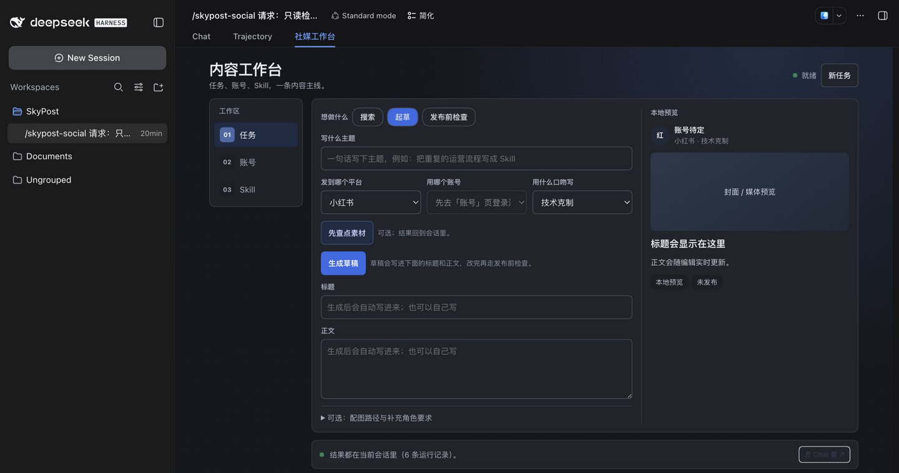
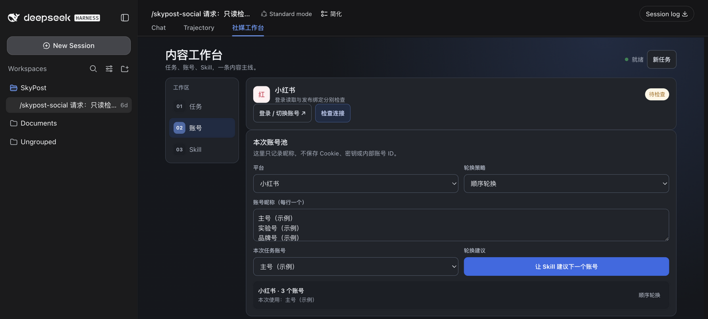
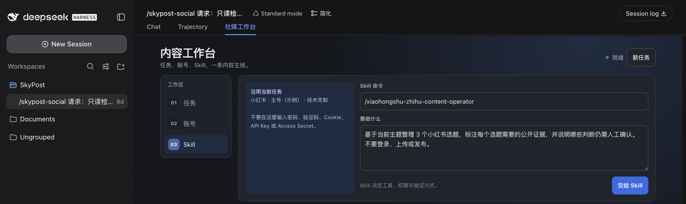

# Social Operations DSH Workbench

This optional DSH Client plugin contributes one additive `conversation.view`
workbench for Xiaohongshu and Zhihu operations. It is reference evidence for
`workflow-to-skill-with-surface`, not another product component.

## What It Looks Like

The three captures below come from a real DSH Web session with this plugin
loaded. The rail, platform card, account pool, persona select, live preview,
and generic Skill dispatcher are the shipped interface; the topic, draft, and
account nicknames are sample input typed locally in the page, not Agent output
and not a live account read.



Task: one brief, one platform/account/role context, the draft editor, and a
local preview that updates while you type.



Accounts: the official login entry, a readiness check, a non-secret nickname
pool per platform, the rotation policy, and the Skill rotation proposal.
Rotation asks the Skill for a recommendation; it never switches credentials.



Skill: dispatch any installed slash Skill through the ordinary DSH message
path, carrying the current platform, account, and role as data.

The workbench has three focused areas and one primary path:

- **任务** keeps the brief, platform, account, role, research, drafting,
  editing, review, and local preview in one task context. A conforming draft
  response is written back into the editor for human revision;
- **账号** keeps a separate non-secret nickname pool, rotation policy, current
  task account, official login link, and readiness check for each platform.
  Duplicate nicknames are removed and the first valid account is selected;
- **Skill** provides an arbitrary installed slash Skill entry point while the
  common research and draft actions stay in the task editor.

The layout responds to the workbench's own width instead of the outer browser
viewport, so the navigation and editor reflow correctly inside a narrow DSH
conversation pane. Only the latest Agent result is visible by default; tool
activity stays in a collapsed run log.

The built-in social operations use the same
`xiaohongshu-zhihu-content-operator` Skill message path. The generic dispatcher
can route another installed slash Skill without teaching the page its internal
tools. The page owns no durable account store, credential switcher, platform API
client, retry loop, upload path, or publication state machine.

The page deliberately does not embed Xiaohongshu or Zhihu. Zhihu rejects
cross-origin framing, and an embedded browser cookie would not prove that the
existing `redbook` or `yxer` adapter can reuse the session. Instead, the page
opens the real official login and creator pages in a separate tab and asks the
ordinary workflow Skill to inspect the configured bindings.

A readiness check also carries the recovery step, so an expired session does not
end in a dead report. When the read session is unauthenticated, the Skill opens
the official login page with the OS default browser and waits for the user to
sign in themselves, then re-runs the read-only check. It is told to use the same
browser profile the configured read tool already reads, and never a separate,
fresh, or headless profile: a session created there would not be visible to that
tool, and exporting cookies to bridge the two is not permitted. No password,
one-time code, or cookie value is ever requested, typed, read, or stored.

Opening a platform website in a browser is not a substitute for an official read
binding. When the required binding is missing, the check reports that integration
gap rather than treating a browser sign-in as the credential.

The controls send this normal DSH message path:

```text
controls
-> SessionFace.prompt('/xiaohongshu-zhihu-content-operator ...')
-> ordinary DSH Skill and tools
-> ordinary Session result
```

It never accepts credentials, calls a platform API, uploads media, or performs
a live publication. Account rotation is a proposal, not a credential switch.
The post request stops after binding checks, validation, and a dry-run. A later
explicit approval in Chat is required for one live submission.

Build and test from `reference/`:

```sh
npm run build --workspace @poiema/actweave-social-page
npm run test --workspace @poiema/actweave-social-page
```
